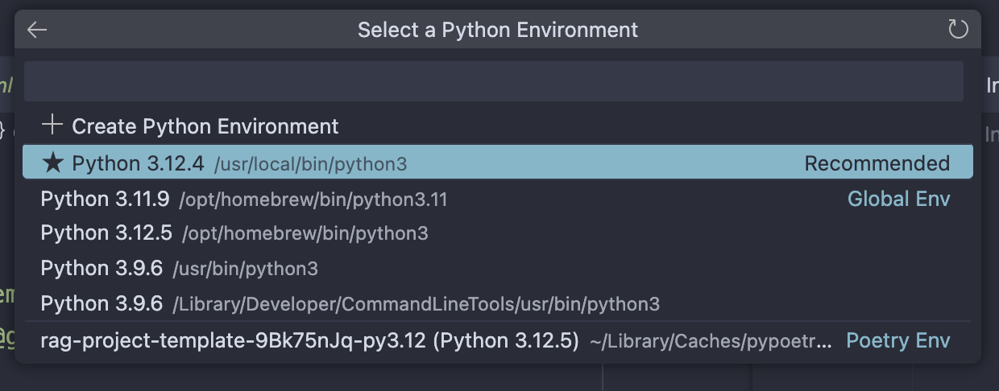

+++
title = "Using a Poetry environment in Visual Studio Code's Python Interactive window"
date = 2024-08-20T16:04:14-07:00
draft = false
+++

**tl;dr** – _If you manage your project's dependencies with [Poetry](https://python-poetry.org/), develop in Visual Studio (VS) Code, and use VS Code's Python interactive window, you can use the [`poetry-monorepo`](https://marketplace.visualstudio.com/items?itemName=ameenahsanma.poetry-monorepo) extension to select your project's poetry environment as the interactive kernel._

## What is poetry?

[Poetry](https://python-poetry.org/) is a slick package builder and dependency manager for python projects. It helps project contributors specify and setup their Python environment.

Say you are working on a python project and need to incorporate a non-standard library, such as [pandas](https://pandas.pydata.org/). You can install it with `pip install pandas` and it will be available for you to use. Other contributors would need to manually do the same or else their environments will be out of date. 

To simplify this task you can include `pandas` (and other non-standard libraries) in a `requirements.txt` file associated with your project. Other contributors will need to run only one command to install all of your project's dependencies: 

``` shell
pip install -r requirements.txt
```

While a simplified workflow, this still leaves any contributor with two steps when they need to add a library to a project: 1. install the library and 2. add it to the `requirements.txt` file. Wouldn't it be nice if we could accomplish both steps with one command?

Enter poetry.

## How poetry works

Once poetry has been [setup for a project](https://python-poetry.org/docs/basic-usage/), you can install a library _and_ add it as a dependency for your project with only one command, for example:

``` shell
poetry add pandas
```

Poetry manages a virtual python environment for your project. When you run the above command it installs the library in that virtual environment, and also notes that library as a dependency in a `pyproject.toml` file:

``` toml
[tool.poetry.dependencies]
pandas = "^2.2.2"
```

As other contributors work on your project, all they will need to do to keep their environment up-to-date (granted that they have installed poetry) is run `poetry install`.

## Running code with poetry

Since poetry is managing a virtual environment behind the scenes, once you are ready to run some code simply running `python your_project.py` as poetry's virtual environment is not activated. Instead you can use `poetry run python your_project.py`, which activates the virtual environment before running the code.

`poetry run` is also useful for running other python-based command line tools that you might use for your project, such as:

``` shell
poetry run pre-commit install # setting up pre-commit workflows
poetry run pytest # running tests
poetry run black # code formatting
```

## Using Python Interactive window with poetry

A development workflow I encourage (as opposed to using [Jupyter Notebooks](https://jupyter.org/), for example) is writing code in python files and executing code in an interactive shell. Visual Studio Code's [Python Interactive window](https://code.visualstudio.com/docs/python/jupyter-support-py#_using-the-python-interactive-window) is great for this workflow. As you are writing your code, hit `Shift+Enter` to run whatever line is you are working on. An interactive window will appear, connect to a python kernel, and you can now easily both write and run code snippets.

Since we're using poetry to manage our virtual environment, however, the python kernel to which we _want to_ connect won't be accessible. What to do?

[`poetry-monorepo`](https://marketplace.visualstudio.com/items?itemName=ameenahsanma.poetry-monorepo) to the rescue. 

`poetry-monorepo` is a Visual Studio Code extension designed to help for this specific use case. From the [project's readme](https://github.com/ihsan-96/vscode-python-poetry-monorepo), it:

> Automatically sets the Python interpreter based on the closest pyproject.toml file in the workspace.

Sure enough, after installing that extension, when you select your python environment in the interactive window, one of the options will be your current poetry environment.

