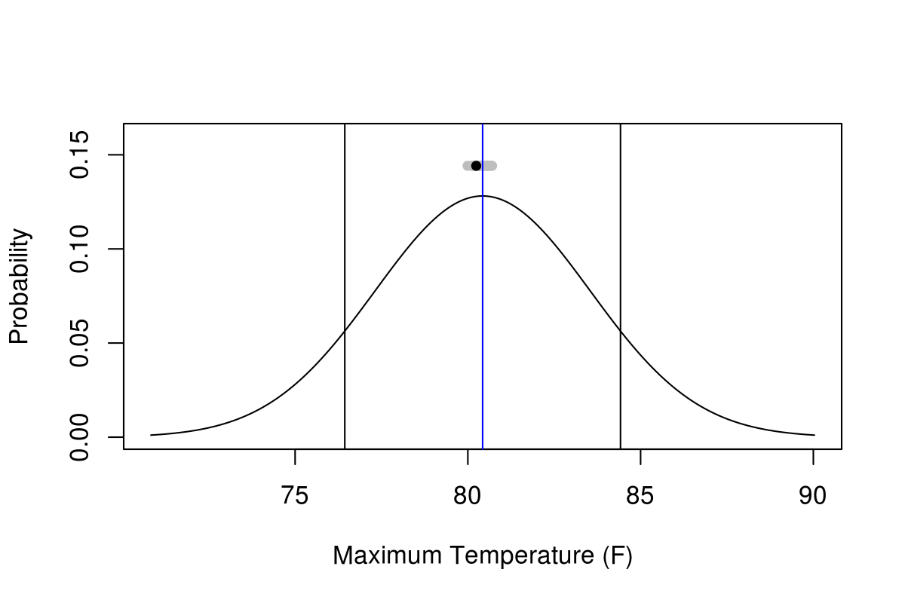
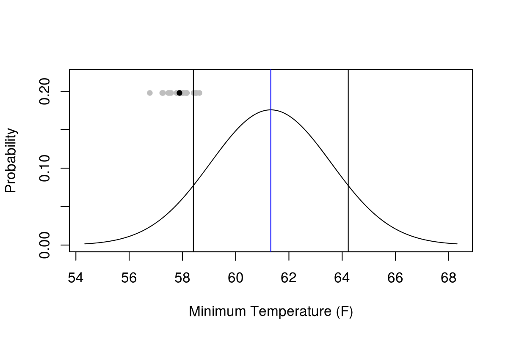
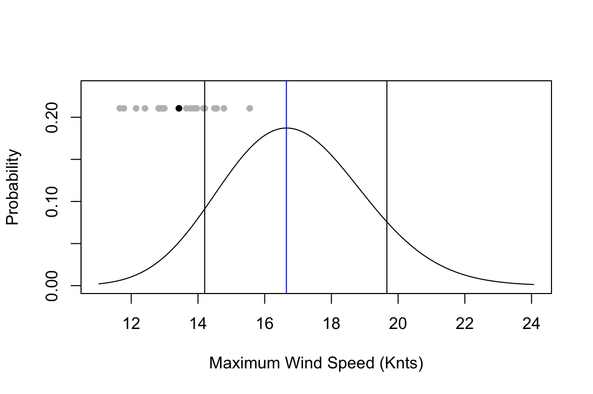

This page provides some tools I use to help me in the [WxChallenge](http://www.wxchallenge.com/). The current city is Harrisburg, PA (KMDT).

* [NWS Forecast](http://forecast.weather.gov/MapClick.php?lat=40.1934&lon=-76.7633#.V_-4vpMrJE4)
* [3-Day Obs](http://w1.weather.gov/data/obhistory/KMDT.html)
* [SREF Plume Viewer](http://www.spc.noaa.gov/exper/sref/srefplumes/)

### Bayesian Model Averaging

Bayesian Model Averaging (BMA) is an ensemble calibration and bias correction technique. For more info, check out [Raftery et al. (2005)](http://journals.ametsoc.org/doi/full/10.1175/MWR2906.1) and [Sloughter et al. (2010)](http://www.tandfonline.com/doi/abs/10.1198/jasa.2009.ap08615). In a nutshell, current ensembles such as the [Global Ensemble Forecast System (GEFS)](https://www.ncdc.noaa.gov/data-access/model-data/model-datasets/global-ensemble-forecast-system-gefs) are biased and uncalibrated. Error in forecasts can be separated into two parts: systematic (predictable and removable) and random. In addition, ensembles are typically under-dispersive, meaning that observations frequently (sometimes more often than not) fall outside the range of ensemble solutions.

BMA is a technique that removes biases in ensemble members and also calibrates ensembles to provide a calibrated [probability density function (PDF)](https://en.wikipedia.org/wiki/Probability_density_function) for a given forecast variable. Below is a calibrated PDF for maximum and minimum temperature and maximum wind speed for Harrisburg, PA. Calibrated precipitation is still in production. Ensemble information comes from the 06Z run of the 0.5 degree GEFS.

> Updated 2016-10-13 17:12 GMT

### Maximum Temperature

If you have questions about these products please [contact me](https://bhlmn.github.io/about.html#contact)!
